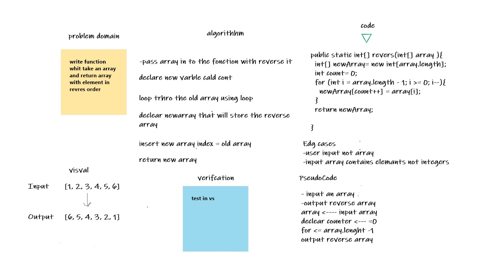

# Reverse an Array

Write a function that returns numbers in reverse

## Whiteboard Process

## Approach & Efficiency

- I created the ِArray
- I defined a variable to work on a lube and rewind numbers as required
- I added a new element to replace the old one
- return new array

## code

public static int[] revers(int[] array ){
int[] newArray= new int[array.length];
int count= 0;
for (int i = array.length - 1; i >= 0; i--){
newArray[count++] = array[i];
}
return newArray;

}
