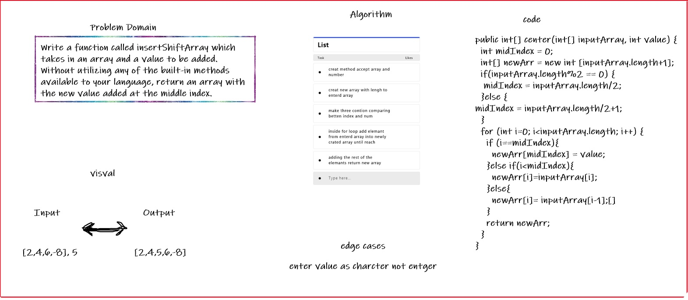

# Insert to Middle of an Array
Write a function called i which takes in an array and a value to be added. , return an array with the new value added at the middle index

## Whiteboard Process

## Approach & Efficiency

Declare new variable to hold entered array length
create new array with length equal to entered array's length+1
define new variable for index position where we want to add entered value equals to (entered array's length/2) if even and
create a for loop with number of iterations equal to new array's length
add the entered value at index position, then continue adding the rest of the elements
return new array

---------------------------------------------------------------------------------------------------------------------------------

public int[] center(int[] inputArray, int value) {
  int midIndex = 0;
  int[] newArr = new int [inputArray.length+1];
  if(inputArray.length%2 == 0) {
   midIndex = inputArray.length/2;
  }else {
midIndex = inputArray.length/2+1;
  }
  for (int i=0; i<inputArray.length; i++) {
    if (i==midIndex){
      newArr[midIndex] = value;
    }else if(i<midIndex){
      newArr[i]=inputArray[i]; 
    }else{
      newArr[i]= inputArray[i-1];[]  
    }
    return newArr;
  }
}
