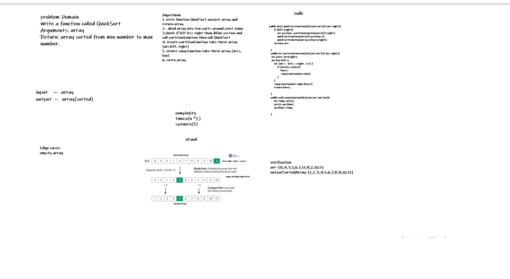

# Challenge Summary
Write a function called
Arguments: arrayQuickSort
Return: array sorted from min number to max number.
## Whiteboard Process

## Approach & Efficiency
complexity
time:o(n ^2)
speace:o(1)
## Solution
```
  public int[] quickSortFunction(int[]arr,int left,int right){
        if (left<right){
            int position= partitionFunction(arr,left,right);
            quickSortFunction(arr,left,position-1);
            quickSortFunction(arr,position+1,right);
        }return arr;
    }
    public int partitionFunction(int[]arr,int left,int right){
     int pivot=arr[right];
     int low=left-1;
        for (int i = left; i <right ; i++) {
            if (arr[i]<=pivot){
                low++;
                swapFunction(arr,i,low);
            }
        }
        swapFunction(arr,right,low+1);
        return low+1;
    }
    public void swapFunction(int[]arr,int i,int low){
        int temp=arr[i];
        arr[i]=arr[low];
        arr[low]=temp;
    }
```