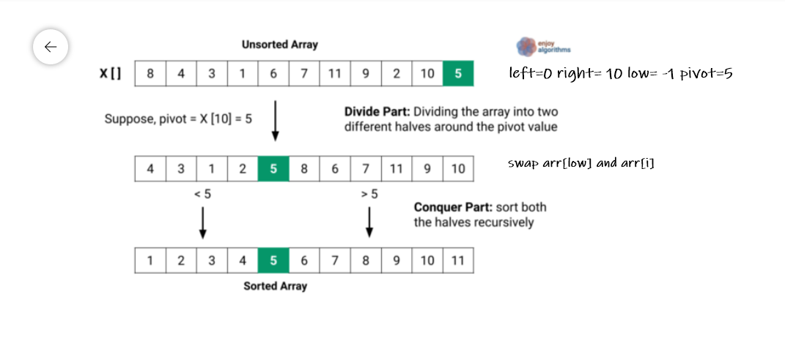

## code28Blog
### QuickSort:
- QuickSort is a Divide and Conquer algorithm. It picks an element as pivot and partitions the given array around the picked pivot. There are many different versions of quickSort that pick pivot in different ways.
  
### Trace:
1. pass1: divid array into tow parts around pivot value.
2. pass2: conguer part: sort both the halves recursively
3. Quick sort array  [1,2,3,4,5,6,7,8,9,10,11]