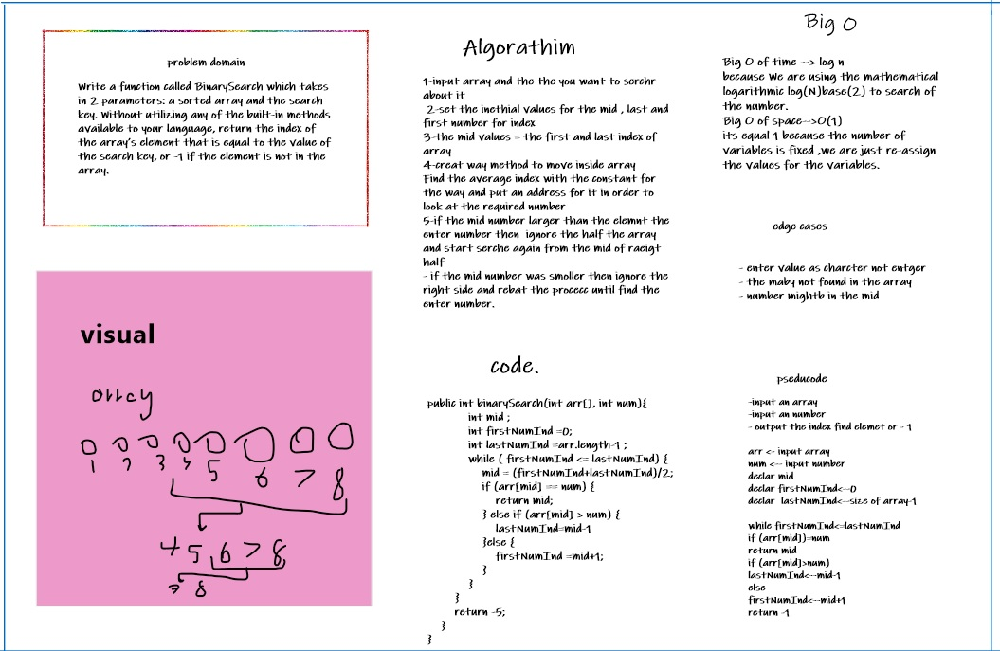

<<<<<<< HEAD:code3/codec3.md
# Binary Search of Sorted Array
Write a function called BinarySearch which takes in 2 parameters: a sorted array and the search key

## Whiteboard Process

## Approach & Efficiency
How do you sort an array in binary search?
Binary Search: Search a sorted array by repeatedly dividing the search interval in half. Begin with an interval covering the whole array. If the value of the search key is less than the item in the middle of the interval, narrow the interval to the lower half. Otherwise, narrow it to the upper half
=======
# code 
[source code ](./code3.java)
# Binary Search of Sorted Array
Write a function called BinarySearch which takes in 2 parameters: a sorted array and the search key

## Whiteboard Process

## Approach & Efficiency

Binary Search: Search a sorted array by repeatedly dividing the search interval in half. Begin with an interval covering the whole array. If the value of the search key is less than the item in the middle of the interval, narrow the interval to the lower half. Otherwise, narrow it to the upper half
>>>>>>> 45513a0d66f94612e45cd9929724d30e247acb9a:code3/readme.md
