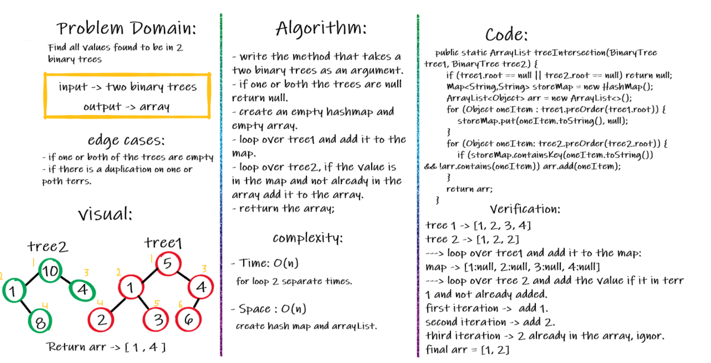
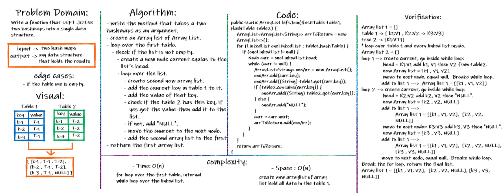

# Hashtables
technique that is used to uniquely identify a specific object from a group of similar objects.
Hashtables are a data structure that utilize key value pairs. This means every Node or Bucket has both a key, and a value.
## Challenge
Challenge Type: New Implementation
## Approach & Efficiency
- Time : if the bucket has no collisions, Hash tables are O(1) average. this is the perfect hashing.
  but however it suffers from O(n) in the collisions cases.
- Space: complexity of O(n).
## API
- **add()**
  Arguments: key, value
  Returns: nothing
  This method should hash the key, and add the key and value pair to the table, handling collisions as needed.
- **get()**
  Arguments: key
  Returns: Value associated with that key in the table
- **contains()**
  Arguments: key
  Returns: Boolean, indicating if the key exists in the table already.
- **hash()**
  Arguments: key
  Returns: Index in the collection for that key
# Repeated Word
## Challenge Summary
Write a function called repeated word that finds the first word to occur more than once in a string.
## Whiteboard Process

## Approach & Efficiency
lopp:
Time Approach : O(N)
Space : O(N)

# tree intersection
## Challenge Summary
Find all values found to be in 2 binary trees
- Write a function called tree intersection
- Arguments: two binary trees
- Return: array
## Whiteboard Process

## Approach & Efficiency
**Time Approach** : O(N) - for loop 2 separate times.
**Space Approach** : O(N) - create hash map and arrayList.
# LEFT JOINs
## Challenge Summary
Write a function that LEFT JOINs two hashmaps into a single data structure.
- Arguments: two hash maps
  - The first parameter is a hashmap that has word strings as keys, and a synonym of the key as values.
  - The second parameter is a hashmap that has word strings as keys, and antonyms of the key as values.
- Return: The returned data structure that holds the results is up to you. It doesn’t need to exactly match the output below, so long as it achieves the LEFT JOIN logic
## Whiteboard Process

## Approach & Efficiency
**Time Approach** : O(N) -for loop over the first table, internal while loop over the linked list.
**Space Approach** : O(N) - create anw arraylist of array list hold all data in the table 1.