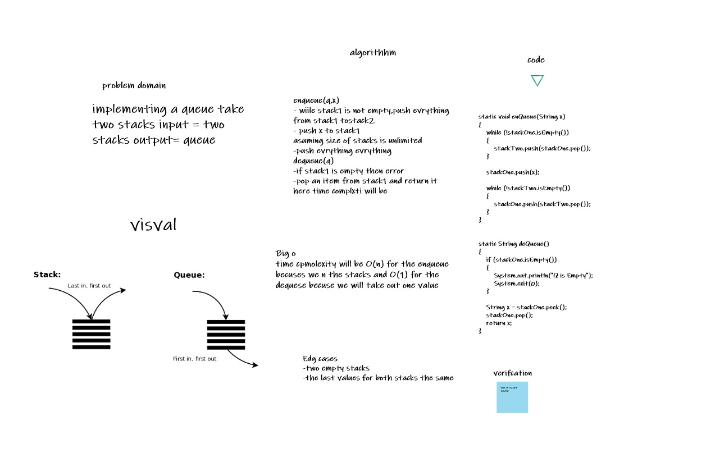

# Stacks and Queues

Stacks and Queues
A stack and a queue are data structures that consist of Nodes. Each Node references the next Node in the stack, but does not reference its previous.
The main difference between them is stack data structure follows Last In First Out (LIFO) principle, while queue data structure follow Last In Last Out (LILO) principle.

Challenge
Create a Queue class that has a front property, and it has following methods: enqueue, dequeue, peek, and isEmpty. Create a Stack class that has a top property, and it has following methods: push, pop, peek, and isEmpty.

1. push :adds a new node with that value to the top of the stack with an O(1) Time performance.
2. pop:Removes the node from the top of the stack.
3. peek:Returns: Value of the node located at the top of the stack.
4. isEmpty:Returns: Boolean indicating whether or not the stack is empty.

1. push :adds a new node with that value to the top of the stack with an O(1) Time performance.
2. pop:Removes the node from the top of the stack.
3. peek:Returns: Value of the node located at the top of the stack.
4. isEmpty:Returns: Boolean indicating whether or not the stack is empty.

--------------------------------------------------------------------------------------
# Challenge Summary
new class called pseudo queue. This PseudoQueue class will utilize 2 stack instances to create and manage the queue to implement our standard queue interface enqueue & dequeue.

## Whiteboard Process

## Approach & Efficiency
or enqueue method I used , so time complexity will be and didn't create new data structure so space . For dequeue method I used an if statement, so time complexity will be O(1) and didn't create new data structure

