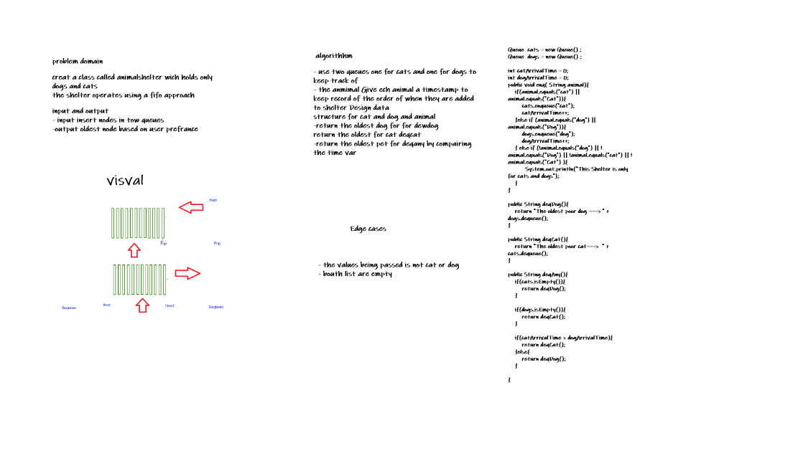
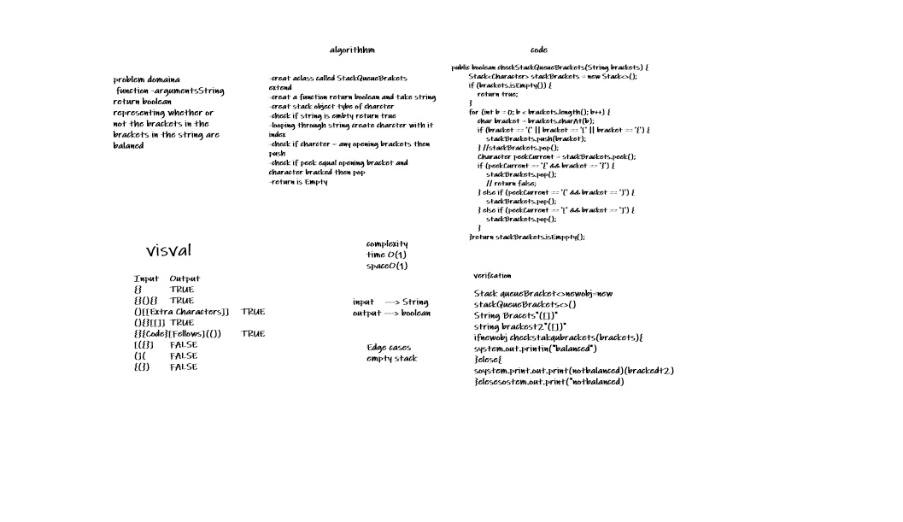

#Stacks and Queues
A stack is a data structure that consists of Nodes. Each Node references the next Node in the stack, but does not reference its previous.
##Queues:
FIFO First In First Out
This means that the first item in the queue will be the first item out of the queue.
LILO Last In Last Out
This means that the last item in the queue will be the last item out of the queue.
##Challenge
Using a Linked List as the underlying data storage mechanism, implement both a Stack and a Queue
##Approach & Efficiency
bigO
space:o(1) time :o(1)
##API
1. Stack
   Create a Stack class that has a top property. It creates an empty Stack when instantiated. This object should be aware of a default empty value assigned to top when the stack is created. The class should contain the following methods:
   push Arguments: value adds a new node with that value to the top of the stack with an O(1) Time performance.
   pop Arguments: none Returns: the value from node from the top of the stack Removes the node from the top of the stack Should raise exception when called on empty stack
   peek Arguments: none Returns: Value of the node located at the top of the stack Should raise exception when called on empty stack
   is empty Arguments: none Returns: Boolean indicating whether or not the stack is empty.
2. Queue
   Create a Queue class that has a front property. It creates an empty Queue when instantiated. This object should be aware of a default empty value assigned to front when the queue is created. The class should contain the following methods:
   enqueue Arguments: value adds a new node with that value to the back of the queue with an O(1) Time performance.
   dequeue Arguments: none Returns: the value from node from the front of the queue Removes the node from the front of the queue Should raise exception when called on empty queue
   peek Arguments: none Returns: Value of the node located at the front of the queue Should raise exception when called on empty stack
   is empty Arguments: none Returns: Boolean indicating whether or not the queue is empty
Feature Tasks
Create a new class called pseudo queue. Do not use an existing Queue. Instead, this PseudoQueue class will implement our standard queue interface (the two methods listed below), Internally, utilize 2 Stack instances to create and manage the queue
Methods:
enqueue Arguments: value Inserts value into the PseudoQueue, using a first-in, first-out approach.
dequeue Arguments: none Extracts a value from the PseudoQueue, using a first-in, first-out approach.
new class called pseudo queue. This PseudoQueue class will utilize 2 stack instances to create and manage the queue to implement our standard queue interface enqueue & dequeue.

## Whiteboard Process

## Approach & Efficiency
or enqueue method I used , so time complexity will be and didn't create new data structure so space . For dequeue method I used an if statement, so time complexity will be O(1) and didn't create new data structure

-------------------------------------------------------------------------------------------------------
# Challenge Summary
Code Challenge: Class 12
Feature Tasks
Create a class called AnimalShelter which holds only dogs and cats. The shelter operates using a first-in, first-out approach.
Implement the following methods:
enqueue Arguments: animal animal can be either a dog or a cat object.
dequeue Arguments: pref pref can be either "dog" or "cat" Return: either a dog or a cat, based on preference. If pref is not "dog" or "cat" then return null.

## Whiteboard Process

## Approach & Efficiency
enqueue
Arguments: animal can be either a dog or a cat.
dequeue
deqDog: returns the oldest dog.
deqCat: returns the oldest cat.
deqAny: returns the oldest pet.

-----------------------------------------------------------------------------------------------------
##Code Challenge: Class 13
Feature Tasks 1.Write a function called validate brackets
Arguments: string
Return: boolean
Implement the following method:
Create function called validate brackets
representing whether or not the brackets in the string are balanced
