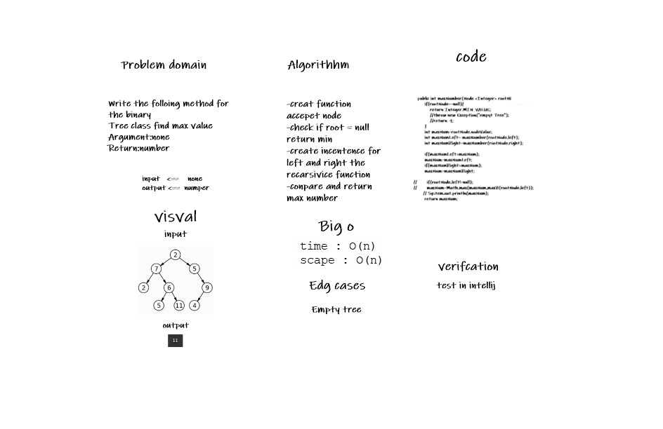

# code 15
## Features

# Node
   Create a Node class that has properties for the value stored in the node, the left child node, and the right child node.
# Binary Tree
   Create a Binary Tree class
   Define a method for each of the depth first traversals:
   pre order
   in order
   post order which returns an array of the values, ordered appropriately.
   Any exceptions or errors that come from your code should be semantic, capture-able errors. For example, rather than a default error thrown by your language, your code should raise/throw a custom, semantic error that describes what went wrong in calling the methods you wrote for this lab.
# Binary Search Tree
   Create a Binary Search Tree class This class should be a sub-class (or your languages equivalent) of the Binary Tree Class, with the following additional methods:
   Add Arguments: value Return: nothing Adds a new node with that value in the correct location in the binary search tree.
   Contains Argument: value Returns: boolean indicating whether or not the value is in the tree at least once.
   ------------------------------------------------------------------------------------------
# code 16
# Challenge Summary
Find the maximum value stored in the tree. You can assume that the values stored in the Binary Tree will be numeric.

## Whiteboard Process

## Approach & Efficiency
Space complexity O(1)  while time complexity is O(1) 
## Solution
To run and test maxValue method, one can either create new tree and call the method on that tree in App.java file, or run pre-written tests in AppTest.java file.
--------------------------------------------------------------------------------------
# code 17
# Challenge Summary
Write a function called breadth first, that traverse the input tree using a Breadth-first approach.

## Whiteboard Process

## Approach & Efficiency
Space complexity O(1) , while time complexity is O(1) .
## Solution
To run and test maxValue method, one can either create new tree and call the method on that tree in App.java file, or run pre-written tests in AppTest.java file.
--------------------------------------------------------------------------------
# code 18
# Challenge Summary
Write a function that compares two file directory structures, and return a boolean whether they have same number of leaves or not.
## Whiteboard Process

## Approach & Efficiency
Space complexity O(1) , while time complexity is O(n) since I used recursion.
## Solution
To run and test maxValue method, one can either create new tree and call the method on that tree in App.java file, or run pre-written tests in AppTest.java file.